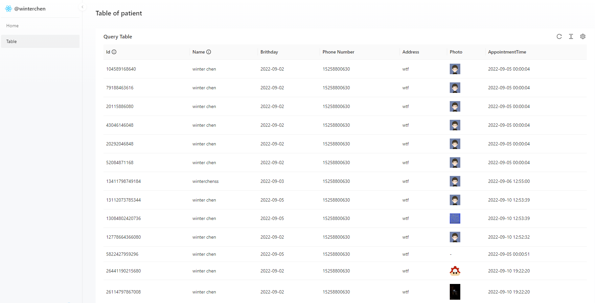

# patient-go

## Overview
this is a simple patient management system. It is a simple application that allows you to create, read patients.

visit the [demo](http://winterchen.com:3002)

visit the font-end [repo](https://github.com/WinterChenS/patient.git)

### home page


### table page



# Quick Start

## Prerequisites

- Golang: 1.16.0 or later
- Mysql: 8.0 or later
- Minio: 2022-01-04T07:41:07Z or later


## check out the source code

```bash
git clone https://github.com/WinterChenS/patient-go.git
```

## Init Database


```mysql

CREATE DATABASE `patient` /*!40100 DEFAULT CHARACTER SET utf8mb4 COLLATE utf8mb4_general_ci */ /*!80016 DEFAULT ENCRYPTION='N' */;

-- patient.patients definition

CREATE TABLE `patients` (
  `id` bigint NOT NULL,
  `name` varchar(35) COLLATE utf8mb4_general_ci NOT NULL,
  `brithday` timestamp NOT NULL,
  `phone` varchar(20) COLLATE utf8mb4_general_ci NOT NULL,
  `address` varchar(255) COLLATE utf8mb4_general_ci DEFAULT NULL,
  `photo` varchar(255) COLLATE utf8mb4_general_ci DEFAULT NULL,
  `driver_license` varchar(100) COLLATE utf8mb4_general_ci DEFAULT NULL,
  `appointment_time` timestamp NOT NULL,
  `created_at` timestamp NULL DEFAULT NULL
) ENGINE=InnoDB DEFAULT CHARSET=utf8mb4 COLLATE=utf8mb4_general_ci COMMENT='patient info';

```

## Update config-dev.yml for your config

```yaml
name: patient-go
mysql: root:root@tcp(127.0.0.1:3306)/patient?charset=utf8&parseTime=true&loc=Asia%2FShanghai
port: 8098
logsPath: "/tmp/logs/patient/"

minio:
  endpoint: "127.0.0.1:9000"
  accessKeyID: "admin"
  secretAccessKey: "admin"
  bucketName: "picture"
  path: "https://winterchen.com/share/"
```

## The deployment of application - normal


### `go build`

```bash
go build
```

### `go run`

```bash
go run main.go
```

## The deployment of application - docker

### `docker build`

```bash
docker build -t patient-go .
```

### `docker run`

```bash
docker run -d -p 8098:8098 --name patient-go patient-go
```

## The deployment of application - docker-compose

the first you need to build the docker image, because the docker-compose.yml use the image.

```bash

```bash
docker build -t patient-go .
```

then you can write the docker-compose.yml


```yaml
version: '3'

services:
  delay-server:
    container_name: patient-go
    image: patient-go
    ports:
      - "8098:8098"
    volumes:
      - "./log:/tmp"
```

and run the docker-compose

```bash
docker-compose up -d
```
